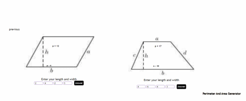
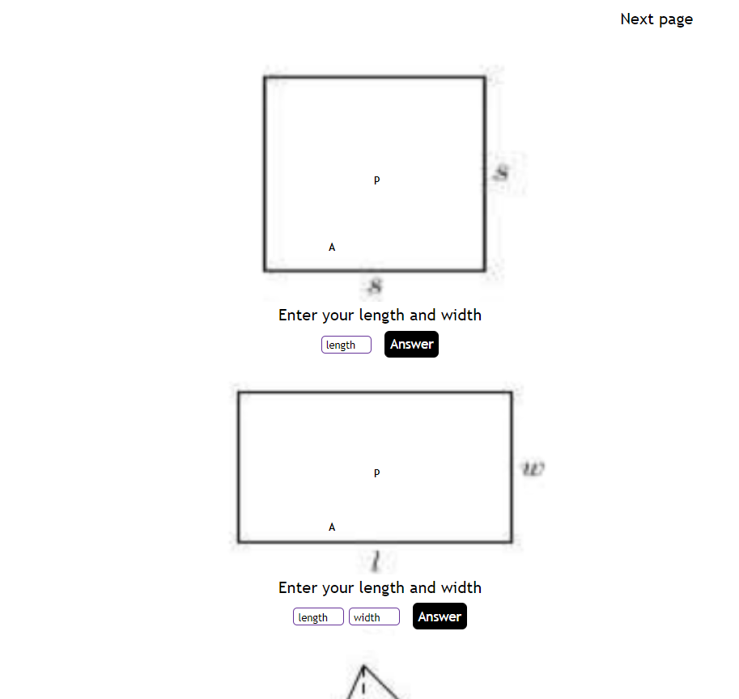
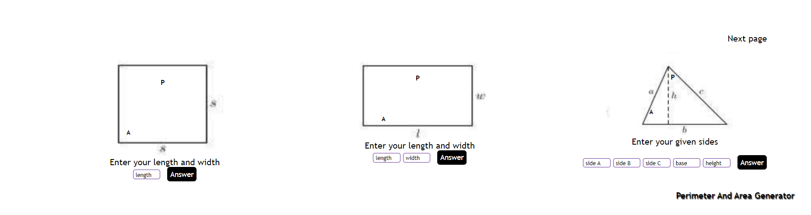
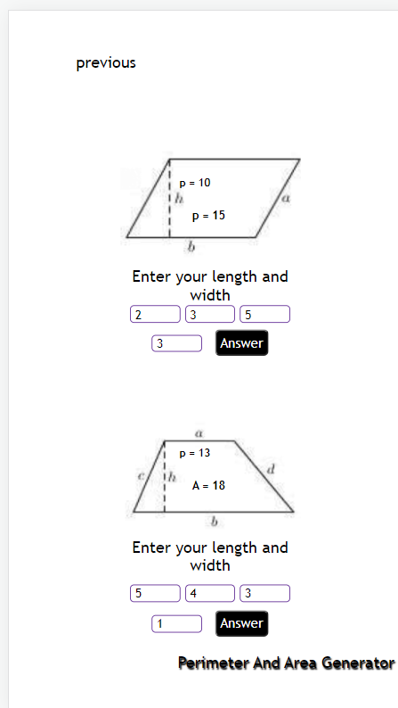
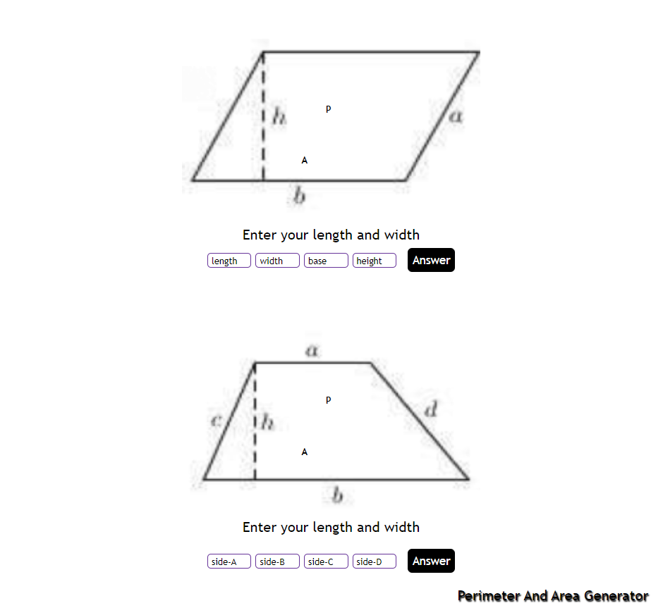

# CREATION OF PERIMETER AND AREA GENERATOR

## WEB CALCULATOR 1

## Welcome back!!!

##let's get started.

Thank you for checking this work.

## About This Work:

This work is created for the purpose of practising and revising (HTML & CSS) with right and well measured web units for the purpose of ensuring effective layout and structure of website, and other HTML templates.

## pictures of this Work

##An Example##
##Collective collections##

##process##
THIS FILE IS FOR THE PRACTISE OF JAVASCRIPT(MATHEMATICS)
-PRACTISE OF STORING DATA IN VARIABLES USING THE RIGHT DATATYPES TOO.
-PRACTISING ORDER OF PROCEDENCE WITH JAVASCRIPT MATHS
-PRACTISING JAVASCRIPT DOM.

THIS FILE IS FOR THE PRACTISE OF HTML AND CSS

-PRACTISED IN DETAILS ALL THE ESSENTIAL CSS LAYOUTS TO ENSURE SMOOTH DEVELOPMENT OF PAGE.
-USED FLEXBOX TO CONTROL THE DISPLAY PATTERN TOO.
-NICE AND ATTRACTIVE FONT USAGE
-USED THE FLOAT PROPERTY TO MOVE TEXT, BOXES AND FAST LINKS AROUND
-USED THE QUERY PROPERTIES(MEDIA) IN ENSURING SMOOTH LAYOUT WITH ALL CHECKPOINTS BEING MET.
-IT'S ALSO RESPONSVE......

##Larger screen sizes##

##smaller screen sizes##

## Built with

      -HTML(Hypertext Mark-up Language)
      -CSS(Cascading Styles Sheet)
      -JS(Javascript)

## My Challanges and lessons

Learnt and enjoyed practising javascript Arithmetics.

## Installations

-For those Farmiliar with Git-hub you can clone the repo and pull to your local workplace to view.

-For those who want to check the work from the site, click here [https://chukwuma5.github.io/perimeter/], to view Thank you once again.

-For those who want to view the file through drop box, click here [https://www.dropbox.com/sh/upjt310n1ligupo/AACjWqqJv1eRAuuAantRa6XRa?dl=0], to view Thank you once again.

-For those who want to view the file through git-hub, click here [https://github.com/chukwuma5/perimeter], to view Thank you once again.

## Best syntax Used

    ``CSS

(queries(media)), (flex-box), and (power of proper font usage).
Media queries is very important to practise building easy and responsive layout stuctures for all sections in the site. You will see them all around modern websites and web apps.
``

## Resources that helped

-For the Colors[https://htmlcolorcodes.com/color-names/]

-For the images, you can use 1.[https://google.com/]

-for the image editing, you can use[https://photoscape.org]

## Licsense

This work is under [MIT] liscence. It's highly free and opensource to anyone.
